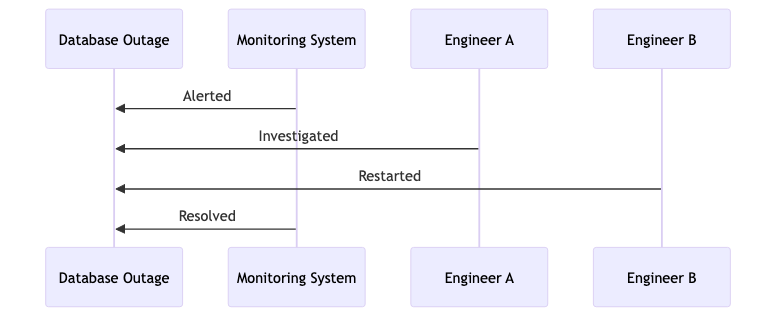

# IncidentFlow

IncidentFlow is a command-line and API-based tool for generating incident diagrams using Mermaid.js. It allows users to convert structured incident data (specific JSON format) into visual sequence diagrams.

## Features
- Generate Mermaid.js diagrams from structured incident data
- Render diagrams as images (PNG/SVG)
- CLI support for easy command-line usage
- API server for integration with external tools


### **Example Output**





## Project Structure

```
IncidentFlow/
├── README.md          # Project documentation
├── cmd/               # CLI-related commands (Cobra)
│   ├── generate.go    # Implements the 'generate' command
│   └── root.go        # Defines the CLI entrypoint
├── internal/          # Core business logic shared by CLI and API
│   ├── diagram/       # Mermaid.js related utilities
│   │   ├── generator.go  # Generates Mermaid.js syntax from incidents
│   │   ├── parser.go     # Parses JSON incident data
│   │   └── render.go     # Renders Mermaid.js into an image
│   ├── models/        # Data models
│   │   └── incident.go  # Defines Incident and Event struct
│   ├── server/        # API server implementation
│   │   └── server.go  # Defines the API handlers
├── tests/             # Unit tests for core functionality
│   ├── generator_test.go
│   ├── parser_test.go
├── incident.json      # Example incident JSON file
├── incident.png       # Sample output diagram
├── go.mod             # Go module dependencies
├── go.sum             # Go module checksums
├── main.go            # Main entrypoint to run CLI or API
└── incidentflow       # Compiled binary (after build)
```


## Installation

### **Prerequisites**
- Go 1.20+ installed
- `mmdc` (Mermaid CLI) installed

To install `mmdc`:
```sh
npm install -g @mermaid-js/mermaid-cli
```

### **Build and run the CLI Binary**
Run the following command to compile the CLI tool:
```sh
go build -o incidentflow main.go
./incidentflow generate --file incident.json --output incident.png
```

## Running as API Server

To start the API server:
```sh
go run main.go server
```

By default, the API runs on `http://localhost:8080`.

Endpoints:
- `POST /generate` - Generate Mermaid.js diagram from JSON payload


## Contribution
Pull requests are welcome! If you'd like to improve or extend this project, please open an issue before submitting changes.


## License
MIT License

